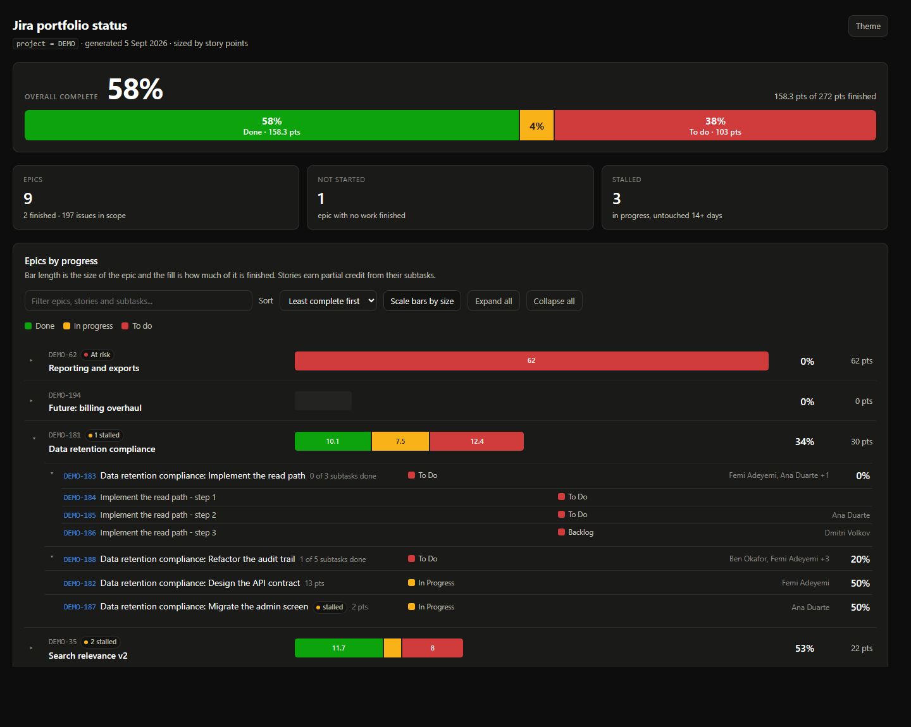

# JiraViz

A .NET 8 console app that pulls an epic portfolio out of Jira and writes a **single
self-contained HTML report** answering one question at a glance: what is almost done, what is
underway, and what has not been started at all.



## What it shows

- **A full-width headline** &mdash; overall completion as a large bar spanning the whole window,
  each segment labelled with its share and its points.
- **A KPI strip** &mdash; epic count, epics with no work finished, stalled issues.
- **Epic progress bars** &mdash; one row per epic, 30px tall, stacked Done / In progress / To do
  in green / amber / red. Bar length is proportional to the epic workload, so a large untouched
  epic is the longest, reddest bar on the page; bars below 12 per cent of the widest are floored
  so their split stays readable. Segment values are printed inside the bar where they fit. Rows
  expand in place to their stories, and stories to their subtasks.
- **Badges** &mdash; *At risk*, *Not started*, *Stalled*, *Unestimated*, *Complete*.
- **People** &mdash; a story row lists everyone on it: its own assignee plus every subtask
  assignee, de-duplicated, with the full list on hover.

Red and green are the classic colour-blind confusion pair, so the bar is never the only cue:
segments always run done, in progress, to do; the completion percentage sits beside every bar;
and the legend and badges carry words.

The report opens in **dark theme** by default; the Theme button toggles to light and the choice
is remembered per browser.

## Quick start, without a Jira instance

The repo ships a stub Jira server, so you can see a full report without any credentials:

```bash
dotnet build

# terminal 1
dotnet run --project tools/JiraViz.StubServer

# terminal 2
dotnet run --project src/JiraViz.Cli -- \
  --url http://localhost:5252 --jql "project = DEMO" --out out/report.html --open
```

The stub serves genuine Jira Server v2 JSON at the real endpoint paths, so the app exercises its
actual HTTP, auth, field-discovery and pagination code. It generates a deterministic portfolio
that deliberately includes the awkward cases: a finished epic, a large epic at 0%, an epic with
no story points at all, stories with no epic, an empty epic, and several stale in-progress issues.

## Against a real Jira

```bash
export JIRAVIZ_TOKEN=<personal access token>
dotnet run --project src/JiraViz.Cli -- \
  --url https://jira.example.com --jql "project = ABC AND resolution IS EMPTY" --out report.html
```

Targets **Jira Server / Data Center** (REST API v2, PAT bearer auth, `startAt` pagination).
It is not a Jira Cloud client: Cloud has removed `/rest/api/3/search` in favour of
`/rest/api/3/search/jql` with `nextPageToken` cursors.

### Options

| Flag | Meaning |
| --- | --- |
| `--url <url>` | Jira base URL (the REST path is appended for you) |
| `--jql "<query>"` | Scope of the report |
| `-o, --out <path>` | Output file (default `report.html`) |
| `--open` | Open the report when it is written |
| `--stalled-days <n>` | Idle days before in-progress work is stalled (default 14) |
| `--epic-type <name>` | Epic issue type name, if renamed |
| `--points-field <id>` | Story Points `customfield_XXXXX`, skipping discovery |
| `--epic-link-field <id>` | Epic Link `customfield_XXXXX`, skipping discovery |
| `--page-size <n>` | Issues per request (default 100) |
| `--insecure` | Skip TLS validation, for interception proxies |

The token comes from `JIRAVIZ_TOKEN` (or `--token`), never from `appsettings.json`.
`JIRAVIZ_URL`, `JIRAVIZ_JQL` and `JIRAVIZ_USER` are also honoured.

## How size and completion are calculated

- A **story's size** is its story points, falling back to `1` when unpointed, so an epic nobody
  estimated is still weighted by issue count instead of vanishing. Epics where that fallback was
  used throughout are badged *Unestimated* and report their size in issues, not points.
- A **story's completion** is `1` if it is Done; otherwise the fraction of its subtasks that are
  Done; otherwise `0.5` if it is in progress. That partial credit is what separates "almost done"
  from "just started" without anyone having to move the story itself.
- An **epic's completion** is the size-weighted mean of its stories.
- **At risk** means at or above the median epic size and under 25% complete.

Statuses are bucketed from Jira's own `statusCategory`. For workflows where that is misleading,
map individual status names in `appsettings.json`:

```json
"statusOverrides": { "Awaiting Release": "Done", "Blocked": "InProgress" }
```

## Layout

| Path | What it is |
| --- | --- |
| `src/JiraViz.Core` | Client, hierarchy, metrics, report writer, HTML template |
| `src/JiraViz.Cli` | Entry point, argument parsing, config |
| `tools/JiraViz.StubServer` | Local fake Jira for development |
| `tests/JiraViz.Core.Tests` | Unit tests for the analysis core |

`dotnet test` runs the suite.

## Notes

- The report is one file with **no external requests at all** &mdash; no CDN, no fonts, no scripts.
  It works from `file://` on a machine with no internet.
- Nothing is ever written back to Jira.
- Burnup and cumulative-flow charts are out of scope: they need each issue's changelog, which is
  a far heavier fetch.
